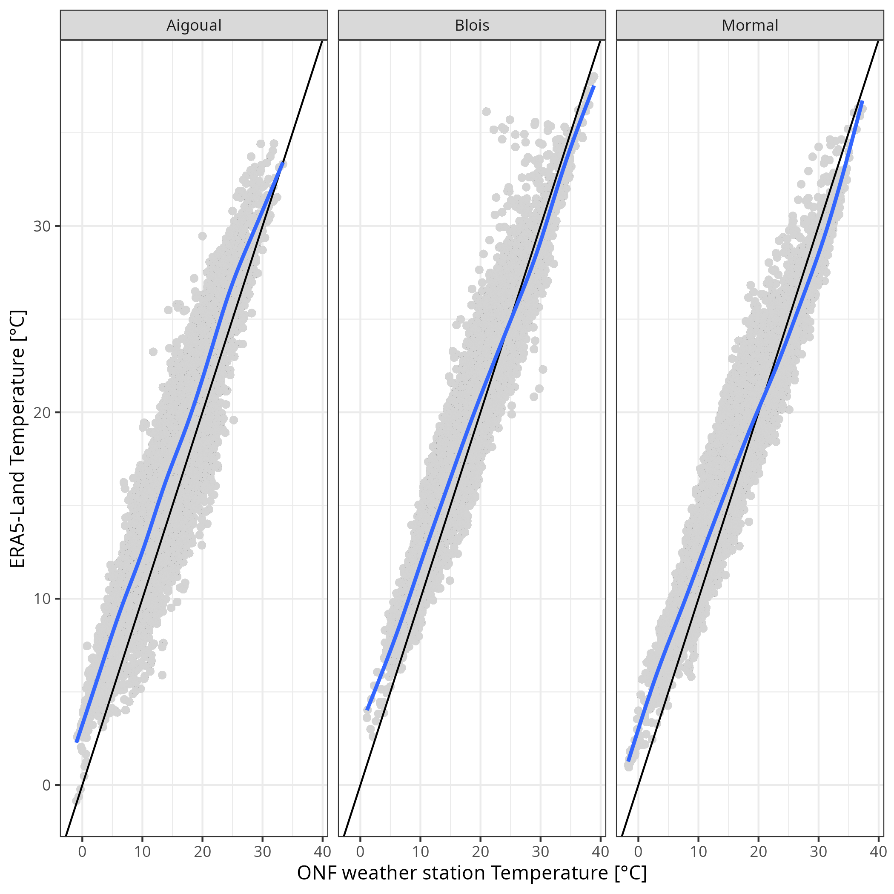

```{r set}
#| message: false
# devtools::install_github("sylvainschmitt/miroclimr")
library(tidyverse)
library(dataverse)
library(microclimr)
library(maps)
library(colorspace)
library(terra)
```

```{r rawdata}
#| eval: false
plots <- list(
  Aigoual = "10.48579/PRO/RSBT3C/VDNSLZ",
  Blois = "10.48579/PRO/RSBT3C/37MKWL",
  Mormal = "10.48579/PRO/RSBT3C/IJAKFT"
) %>% lapply(get_dataframe_by_doi, server = "data.indores.fr") %>% 
  bind_rows(.id = "site")
write_tsv(plots, "data/plots.tsv")
plots %>% 
  group_by(site) %>% 
  summarise(lon = mean(longwgs84), lat = mean(latwgs84)) %>% 
  write_tsv("data/coords.tsv")
temperatures <- list(
  Aigoual = "10.48579/PRO/ZQBQUW/MK2F35",
  Blois = "10.48579/PRO/ZQBQUW/ZL0LOC",
  Mormal = "10.48579/PRO/ZQBQUW/GBVNRR"
) %>% lapply(get_dataframe_by_doi, server = "data.indores.fr") %>% 
  bind_rows(.id = "site")
write_tsv(temperatures, "data/hobo.tsv")
lidar <- list(
  Aigoual = "10.48579/PRO/XH62TC/P4F7FP",
  Blois = "10.48579/PRO/XH62TC/OI6WQU",
  Mormal = "10.48579/PRO/XH62TC/5RXUGU"
) %>% lapply(get_dataframe_by_doi, server = "data.indores.fr") %>% 
  bind_rows(.id = "site")
write_tsv(lidar, "data/lidar.tsv")
lidar_sub <- lidar %>% 
  filter(buffer == 5) %>% 
  rename(plot = idplot) %>% 
  select(site, plot, pai)
era <- read_tsv("data/era.tsv") %>% 
  mutate(site = recode(dim_0, "0" = "Aigoual", "1" = "Blois", "2" = "Mormal")) %>% 
  mutate(datetime = as_datetime(time)) %>% 
  rename(era = tas) %>% 
  select(site, datetime, era)
onf <- list.files("data/methor_data_onf/", pattern = ".txt", full.names = TRUE) %>% 
  vroom::vroom(col_names = read_tsv("data/methor_data_onf/MetHor2018.org") %>% 
                 names()) %>% 
  select("Code placette",
         "Date",
         "Heure (TU)",
         "Température instantanée (°C)") %>% 
  mutate(datetime = paste0(str_sub(Date, 7, 10), "-",
                           str_sub(Date, 4, 5), "-",
                           str_sub(Date, 1, 2), " ",
                           str_sub(`Heure (TU)`, 1, 2), ":",
                           str_sub(`Heure (TU)`, 3, 4), ":00")) %>% 
  mutate(datetime = as_datetime(datetime)) %>% 
  rename(onf = "Température instantanée (°C)", plot = "Code placette") %>% 
  filter(plot %in% c("CHP 59", "CHS 41", "HET 30")) %>% 
  mutate(site = recode(plot, "CHP 59" = "Mormal",
                       "CHS 41" = "Blois", "HET 30" = "Aigoual")) %>% 
  select(site, datetime, onf) %>% 
  mutate(onf = gsub(",", ".", onf)) %>% 
  mutate(onf = as.numeric(onf))
data <- temperatures %>% 
  mutate(datetime = as_datetime(datetime)) %>% 
  rename(hobo = t_hobo, plot = id_plot, sensor = id_sensor,
         position = position_sensor) %>% 
  mutate(position = recode(position, "a" = "air", "s" = "soil")) %>% 
  select(site, plot, sensor, position, datetime, hobo) %>% 
  left_join(era) %>% 
  left_join(onf) %>% 
  left_join(lidar_sub)
write_tsv(data, "data/data.tsv")
```

```{r decomposition}
#| eval: false
data <- read_tsv("data/data.tsv")
fc <- data %>%
  filter(month(datetime) %in% 5:9) %>% 
  gather(source, temperature,
         -site, -plot, -sensor, -position, -datetime, -pai) %>% 
  group_by(source, site, plot, sensor, position, pai,
           datetime = floor_date(datetime, "2 hour")) %>%
  summarise(temperature = mean(temperature)) %>% 
    group_by(source, site, plot, sensor, position, pai) %>%
  do(fft = fft_roll(
    data = .,
    t = 5*12,
    index_col = "datetime",
    temperature_col = "temperature",
    window = "5 days",
    step = "3 days"
  )) %>%
  unnest(fft)
write_tsv(fc, "data/decomposition.tsv")
```

## Abstract

*Abstract.*

## Introduction

*Introduction.*

## Method: Spectral Decomposition of Temperature Time Series via the Fourier Transform

Temperature records measured continuously over time — whether by a microclimate sensor inside a forest or by a macroclimate reanalysis product or weather station in open field — are inherently periodic signals. Daily heating and cooling, seasonal rhythms, and longer climatic cycles all superimpose upon one another to produce the complex thermal fluctuations that ecologists observe. To disentangle these overlapping rhythms and quantify how the forest modifies each of them independently, we decomposed temperature time series using the Discrete Fourier Transform (DFT).

**Mathematical framework.** Let $T(t_j)$, $j = 0, 1, \ldots, N-1$, denote a temperature time series sampled at regular intervals $\Delta t$ (here, hourly) over a total duration $N \Delta t$. The DFT decomposes this signal into a sum of complex sinusoids:

$$\hat{T}(f_k) = \sum_{j=0}^{N-1} T(t_j)\, e^{-2\pi i\, j\, k / N}, \quad k = 0, 1, \ldots, N-1,$$

where $f_k = k / (N \Delta t)$ is the $k$-th frequency (in cycles per unit time) and $i$ is the imaginary unit. The amplitude spectrum $|\hat{T}(f_k)|$ quantifies the contribution of each frequency to the total signal, while the phase $\arg(\hat{T}(f_k))$ captures the timing of each periodic component. In practice, computations are performed via the Fast Fourier Transform (FFT) algorithm, which reduces the computational complexity from $\mathcal{O}(N^2)$ to $\mathcal{O}(N \log N)$.

The inverse DFT reconstructs the original signal exactly:

$$T(t_j) = \frac{1}{N} \sum_{k=0}^{N-1} \hat{T}(f_k)\, e^{2\pi i\, j\, k / N}.$$

Because temperature is a real-valued signal, the spectrum is Hermitian symmetric ($\hat{T}(f_{N-k}) = \overline{\hat{T}(f_k)}$), so only the first $N/2$ frequencies carry independent information. We therefore report the one-sided amplitude spectrum scaled by $2/N$ (except at the zero-frequency and Nyquist components).

**Ecological interpretation.** Key frequencies in a temperature record correspond to ecologically meaningful cycles, for instance the diurnal cycle with a frequency of 1/24 hr (@fig-proj). Expressing temperature variability in the frequency domain thus allows us to ask not simply "how much cooler is the forest interior?" but rather "at which timescales does the forest attenuate or amplify climatic variability?" Forest canopies are expected to buffer high-frequency (diurnal) fluctuations more strongly than low-frequency (seasonal) ones, because the physical mechanisms responsible — thermal inertia of soil and litter, latent heat exchanges, and radiative shading — operate preferentially at short timescales. As illustrated in @fig-proj for a representative 5-day temperature time series, the spectral decomposition successfully resolves the signal into its constituent frequencies: a mean microclimate temperature of 16.24°C, a diurnal amplitude of 3°C at the 24-hour period, and higher harmonics — together revealing that the forest microclimate substantially buffers the diurnal temperature extremes relative to the macroclimate.

```{r proj_freq}
#| label: fig-proj
#| message: false
#| warning: false
#| fig-cap: HOBO and weather station temperature decomposition and reprojection for different frequencies. We used a temperature serie from the 7th to the 12th of August 2023 for a HOBO (dark lines) in Mormal forest measuring air temperature in plot 59_58 and its associated ONF weather station (light lines) with raw data represented in upper left panel (data description below). Lower left panel represent the resulting HOBO power spectrum after Fourrier's decomposition, with a mean temperature of 16.24°C and frequency above 1/24h highlighted in blue ("trend") and frequency 1/24h and its harmonics highlighted in red ("day"). The resulting temperature projections for the highlighted frequencies are given in the upper right panel (trend in blue) and lower right panel (day in red). Dark lines represents HOBO microclimate data and projections while light lines represents weather station macroclimate data and projections.
cols <- c("firebrick", "darkgrey",  "darkblue")
data <- "data/data.tsv" %>% 
  read_tsv() %>% 
  filter(year(datetime) == 2023,
         month(datetime) == 8) %>% 
  filter(position == "air",
         plot == "59_58") %>% 
  arrange(datetime) %>% 
  filter(day(datetime) %in% 7:12)
fc_h <- fft_tab(data$hobo, 24*6) %>% 
  mutate(amplitude = Re(coefficient),
         phase = Im(coefficient)) %>% 
  mutate(coeff_sup = ifelse(frequency > 1/(24+1), 0, 
                            complex(real = amplitude, imaginary = phase))) %>% 
  mutate(type = ifelse(frequency > 1/(24+1), "other", "trend")) %>% 
  mutate(coeff_day = ifelse(frequency  %in% c((1:12)/24),
                            complex(real = amplitude, imaginary = phase), 0)) %>% 
  mutate(type = ifelse(frequency  %in% c((1:12)/24), "day", type)) 
data$t_h_sup <- fft_reconstruct(fc_h$coeff_sup, fc_h$frequency[-1], 1:144)
data$t_h_day <- fft_reconstruct(fc_h$coeff_day, fc_h$frequency[-1], 1:144)+fc_h$power[1]
fc_o <- fft_tab(data$onf, 24*6) %>% 
  mutate(amplitude = Re(coefficient),
         phase = Im(coefficient)) %>% 
  mutate(coeff_sup = ifelse(frequency > 1/(24+1), 0, 
                            complex(real = amplitude, imaginary = phase))) %>% 
  mutate(type = ifelse(frequency > 1/(24+1), "other", "trend")) %>% 
  mutate(coeff_day = ifelse(frequency  %in% c((1:12)/24),
                            complex(real = amplitude, imaginary = phase), 0)) %>% 
  mutate(type = ifelse(frequency  %in% c((1:12)/24), "day", type)) 
data$t_o_sup <- fft_reconstruct(fc_o$coeff_sup, fc_o$frequency[-1], 1:144)
data$t_o_day <- fft_reconstruct(fc_o$coeff_day, fc_o$frequency[-1], 1:144)+fc_o$power[1]
g_data <- ggplot(data, aes(x = datetime)) +
  geom_line(aes(y = onf), col = lighten("black", 0.5)) +
  geom_line(aes(y = hobo), col = "black") +
  theme_bw() +
  xlab("") + ylab("Temperature [°C]") +
  ylim(8, 28)
g_fc <- fc_h %>% 
  filter(period != 0) %>% 
  ggplot(aes(frequency, power, fill = type)) +
  geom_col() +
  theme_bw() +
  scale_x_continuous(
    breaks = c(1/24, 1/12, 1/8, 1/6, 1/4),
    labels = c("1/24", "2/24", "3/24", "4/24", "6/24")
  ) +
  scale_fill_manual("", values = cols) +
  theme(legend.position = c(0.8, 0.6)) + 
  xlab("Frequency [hr]") + ylab("Power [°C]") +
  theme(axis.text.x = element_text(angle = 45)) +
  annotate("text", x=3/24, y=3, label = paste0("Mean:", round(fc_h$power[1],2)))
g_sup <- ggplot(data, aes(datetime)) +
  geom_line(aes(y = t_o_sup), col = lighten(cols[3], 0.5)) +
  geom_line(aes(y = t_h_sup), col = cols[3]) +
  theme_bw() +
  xlab("") + ylab("") +
  ylim(8, 28) +
  annotate("text", x=data$datetime[24], y=25, label = "trend", col = cols[3])
g_day <- ggplot(data, aes(datetime)) +
  geom_line(aes(y = t_o_day), col = lighten(cols[1], 0.5)) +
  geom_line(aes(y = t_h_day), col = cols[1]) +
  theme_bw() +
  xlab("") + ylab("") +
  ylim(8, 28) +
  annotate("text", x=data$datetime[24], y=25, label = "day", col = cols[1])
gridExtra::grid.arrange(grobs = list(g_data, g_fc, g_sup, g_day),
                        layout_matrix = cbind(c(1, 2), c(3, 4)),
                        widths = c(1.5, 1))
```

## Study sites and data

*Imprint project description* [@gril2024] (@fig-sites)*.* Additionally macroclimatic data were retrieved either from ERA5-Land global reanalysis [@muñoz-sabater2021] or from ONF ... *to be further described.*

```{r sites}
#| label: fig-sites
#| message: false
#| warning: false
#| fig-cap: "Caption."
sites <- read_tsv("data/plots.tsv") %>% 
  group_by(site) %>% 
  summarise_all(mean) %>% 
  rename(long = longwgs84, lat = latwgs84) 
france <- map_data("france")
fr <- ggplot(france, aes(x = long, y = lat)) +
  tidyterra::geom_spatraster(data = rast("data/erafrance.nc"), alpha = .5) +
  geom_point(data = sites, size = 2) +
  ggrepel::geom_text_repel(data = sites, aes(label = site)) +
  coord_sf() +
  theme_void() +
  theme(
    plot.background = element_rect(fill = "white", color = NA)
  ) +
  scico::scale_fill_scico(
      name     = "°C",
      palette  = "lajolla",
      midpoint = 25,
      limits   = c(12, 35),
      na.value = "white", direction = -1
    )
si <- read_tsv("data/plots.tsv") %>% 
  rename(plot = idplot) %>% 
  left_join(read_tsv("data/data.tsv") %>% filter(position == "air", datetime == as_datetime("2023-08-11 12:00:00")) %>% select(plot, hobo)) %>% 
  rename(lon = longwgs84, lat = latwgs84) %>%
  split(.$site) %>% 
  lapply(function(x) {
    points <- sf::st_as_sf(x, coords = c("lon", "lat"), crs = 4326)
    bg <- maptiles::get_tiles(points, provider = "Esri.WorldImagery", zoom = 12)
    ggplot(points, aes(fill = hobo)) +
      tidyterra::geom_spatraster_rgb(data = bg) +
      geom_sf(shape = 21, col = "black") +
      theme_bw() +
      ggtitle(unique(x$site)) +
      scico::scale_fill_scico(
        guide = "none",
        palette  = "lajolla",
        midpoint = 25,
        limits   = c(12, 35),
        na.value = "grey90", direction = -1
      )
  })
cowplot::plot_grid(plotlist = c(fr, si))
```

## Study case 1 - Microclimate assessment

We decomposed all the temperature series for ERA5-Land and HOBOs in May to September for each plot and sensor on 5 days window sliding of 3 days. We then built power spectrums for air temperatures (@fig-ps), using HOBO microclimate temperatures and ERA5-Land and ONF macroclimate temperatures, for the locations of Aigoual, Blois and Mormal. The power spectrum revealed higher mean temperature and power at 24-hr periods for the ERA5-Land data reanalysis compared to the ONF weather stations, which could bias buffer estimates (see also @fig-macro to discuss bias). *Need to add SIs on buffer [@fig-bufferobs, @fig-buffer]. Need to say we found back the link with vegetation from previous studies [@fig-pai]*

```{r ps}
#| label: fig-ps
#| message: false
#| warning: false
#| fig-cap: Power spectrum for air and soil temperatures, using HOBO microclimate temperatures and ERA5-Land and ONF macroclimate temperatures, for the locations of Aigoual, Blois and Mormal
t <- "data/decomposition.tsv" %>% 
  read_tsv() %>% 
  group_by(source, site,  position, frequency, period) %>% 
  summarise(sd = sd(power, na.rm = TRUE),
            power = mean(power, na.rm = TRUE)) %>% 
  mutate(type = ifelse(source == "hobo", "Micro", "Macro")) %>% 
  mutate(source = recode(source,
                         "era" = "ERA5-Land",
                         "onf" = "ONF weather station",
                         "hobo" = paste("HOBO", position))) %>% 
  filter(!(type == "Macro" && position == "soil"))
t %>% 
  filter(period != 0) %>% 
  ggplot(aes(frequency, power)) +
  geom_col(fill = "darkgrey") +
  geom_linerange(aes(ymin = power-sd, ymax = power+sd)) +
  theme_bw() +
  xlab("Period [h]") +
  ylab("Power") +
  scale_x_continuous(
    breaks = c(1/120*2, 1 / 24*2, 1 / 12*2, 1 / 8*2, 1 / 6*2, 1 / 3*2),
    labels = c("5d", "24", "12", "8", "6", "3")
  ) +
  theme(legend.position.inside = c(0.8, 0.8)) +
  facet_grid(site ~ paste0(type, "\n", source)) +
  geom_text(x = 1/3, y = 6,
            aes(label = paste0("Mean: ", round(power), "±", round(sd))), 
            data = filter(t, period ==0))
```

We then computed the microclimate buffers as ratios of mean temperature and power for the 24-hr period (@fig-ratios). We look only at sensors with at least 2/3 of expected windows (160). *Interperation.*

```{r ratios}
#| label: fig-ratios
#| message: false
#| warning: false
#| fig-cap: Mean temperature vs. 24-h amplitude ratios of HOBO microclimate sensors against ONF weather station for air and soil sensors at Aigoual, Blois and Mormal forests. The point represents the median, the thick line the 50 percent distribution and the thine line the 90 percent distribution.
read_tsv("data/decomposition.tsv") %>% 
  filter(source != "era") %>% 
  filter(period %in% c(0,12)) %>% 
  pivot_wider(names_from = source, values_from = power) %>% 
  select(-coefficient, -frequency) %>% 
  na.omit() %>% 
  mutate(ratio = hobo/onf) %>% 
  select(-hobo, -onf) %>% 
  mutate(period = paste0("period_", period)) %>% 
  group_by(position, site, period) %>% 
  summarise(q05 = quantile(ratio, .05),
            q25 = quantile(ratio, .25),
            q5 = quantile(ratio, .5),
            q75 = quantile(ratio, .75),
            q95 = quantile(ratio, .95)) %>% 
  gather(metric, value, -position, -site, -period) %>% 
  mutate(period_metric = paste0(period, "_", metric)) %>% 
  select(-period, -metric) %>% 
  pivot_wider(names_from = period_metric, values_from = value) %>% 
  ggplot(aes(period_0_q5, period_12_q5, col = position)) +
  geom_vline(xintercept = 1, col = "darkgrey") +
  geom_hline(yintercept = 1, col = "darkgrey") +
  geom_segment(aes(x = period_0_q25, xend = period_0_q75)) +
  geom_segment(aes(x = period_0_q05, xend = period_0_q95), linewidth = .2) +
  geom_segment(aes(y = period_12_q25, yend = period_12_q75)) +
  geom_segment(aes(y = period_12_q05, yend = period_12_q95), linewidth = .2) +
  geom_point() +
  theme_bw() +
  ggrepel::geom_text_repel(aes(label = site), col = "black") +
  scale_color_manual("", values = c("#a9d9e5", "#c89867")) +
  xlab("Mean temperature ratio") +
  ylab("24-h amplitude ratio")
```

## Study case 2 - Macroclimate debiasing

*Example of debiasing between ONF and ERA5-Land for on of the sites.*

## Discusson

*Discussion.*

## Supplementary material

```{r macro_code}
#| message: false
#| warning: false
#| eval: false
g <- read_tsv("data/data.tsv") %>% 
  filter(position == "air") %>% 
  filter(month(datetime) %in% 5:9) %>% 
  ggplot(aes(onf, era)) +
  geom_point(alpha = .5, col = "lightgrey") +
  geom_abline() +
  geom_smooth(methode = "lm", se = FALSE) +
  facet_wrap( ~ site) +
  theme_bw() +
  xlab("ONF weather station Temperature [°C]") +
  ylab("ERA5-Land Temperature [°C]")
ggsave("fig1.png", g)
```

```{r macro_fig}
#| label: fig-macro
#| fig-cap: Macroclimatic temperature of ONF weather stations against ERA5-Land reanalysis. The black line represents the 1:1 line and the blue line a smoothing. Despite an overestimation of low temperatures in ERA5-Land, especially in Aigoual, and a slight underestimation of very high temperatures in Mormal, they show high similarity.

```

```{r bufferobs}
#| label: fig-bufferobs
#| message: false
#| warning: false
#| fig-cap: Number of windows with available data for 5-days windows sliding on 3 days between May and September from 2020 to 2023 for air and soil sensors in the Mormal, Blois and Aigoual forests, for ONF and ERA5-Land macroclimate data.
buffers <- read_tsv("data/decomposition.tsv") %>% 
  filter(period == 12) %>% 
  select(source, site, plot, sensor, position, pai, power, datetime) %>% 
  pivot_wider(names_from = source, values_from = power) %>% 
  mutate(ratio_era = hobo/era, ratio_onf = hobo/onf) %>% 
  select(-era, -hobo, -onf) %>% 
  gather(source, ratio, -site, -plot, -sensor, -pai, -datetime, -position) %>% 
  mutate(source = gsub("ratio_", "", source))
buffers %>% 
  mutate(source = recode(source,
                         "era" = "ERA5-Land",
                         "onf" = "ONF weather station")) %>% 
  group_by(plot, position, source) %>% 
  summarise(nobs = n()) %>% 
  ggplot(aes(nobs)) +
  geom_histogram(fill = "lightgrey") +
  facet_grid(position ~ source) +
  theme_bw() +
  geom_vline(xintercept = 107) +
  xlab("Number of windows")
```

```{r buffer}
#| label: fig-buffer
#| message: false
#| warning: false
#| fig-cap: The amplitude ratio for the 24-hour period between May and September from 2020 to 2023 for air and soil sensors in the Mormal, Blois and Aigoual forests, for ONF and ERA5-Land macroclimate data.
buffers %>% 
  group_by(plot, position, source) %>% 
  filter(n() > 107) %>%
  ungroup() %>% 
  mutate(source = recode(source,
                         "era" = "ERA5-Land",
                         "onf" = "ONF weather station")) %>% 
  ggplot(aes(plot, ratio, fill = position, col = position)) +
  geom_violin() +
  facet_grid(source ~ site, scales = "free_x") +
  theme_bw() +
  geom_hline(yintercept = 1) +
  theme(axis.text.x = element_blank(),
        axis.title.x = element_blank(),
        axis.ticks.x = element_blank()) +
  ylab("Amplitude ratio for the period 24-hr") +
  scale_y_sqrt() +
  scale_fill_manual("", values = c("#a9d9e5", "#c89867")) +
  scale_color_manual("", values = c("#a9d9e5", "#c89867"))
```

```{r pai}
#| label: fig-pai
#| message: false
#| warning: false
#| fig-height: 8
#| fig-cap: The relationship between the mean amplitude ratio per sensor over the 24-hour period between May and September from 2020 to 2023 for air and soil sensors, and the plot area index in the Mormal, Blois and Aigoual forests.
buffers %>% 
  group_by(plot, position, source) %>% 
  filter(n() > 107) %>%
  ungroup() %>% 
  group_by(source, site, plot, sensor, position, pai) %>% 
  summarise(ratio = mean(ratio, na.rm = TRUE)) %>% 
  mutate(source = recode(source,
                         "era" = "ERA5-Land",
                         "onf" = "ONF weather station")) %>% 
  ggplot(aes(pai, ratio, col = site)) +
  geom_point() +
  theme_bw() +
  geom_smooth(method = "lm") +
  ggpubr::stat_regline_equation(
    aes(label =  paste(..eq.label.., ..adj.rr.label.., sep = "~~~~")),
  ) +
  theme(legend.position = "bottom") +
  xlab("Plant Area Index") +
  ylab("Mean Amplitude ratio for period 24-hr") +
  scale_color_discrete("") +
  facet_grid(position ~ source)
```
